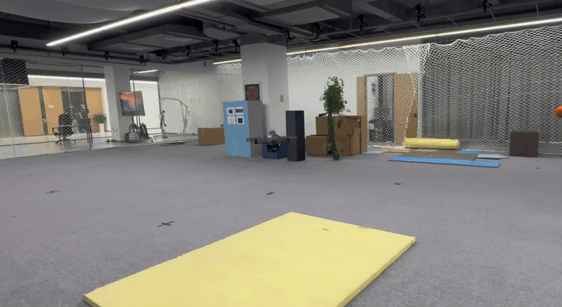
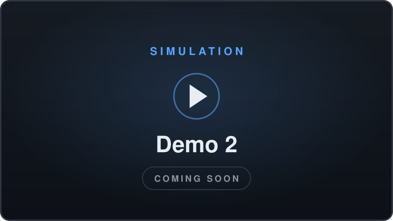

<div align="center">

# OmniRisk

### Omnidirectional Trajectory-Risk Learning for Agile Quadrotor Dynamic Avoidance

Yifan He · Yang Liu · Wenhao Zhao · Hai Lin · Deping Zhang · Mingze Ma<br>
Fei Gao · Huan Yu · Zipeng Dai · Ziming Ding

[](https://arxiv.org/abs/2609.18191)
[](#)
[](#)
[](LICENSE)



OmniRisk learns trajectory-level risk offline and evaluates it for all candidate maneuvers in a single forward pass onboard, enabling agile quadrotor dynamic avoidance at relative encounter speeds up to **15 m/s** in real-world flights.

</div>

## Demos

<table>
  <tr>
    <td width="50%" align="center"><br><sub><b>Simulation</b> · Demo 1</sub></td>
    <td width="50%" align="center"><br><sub><b>Simulation</b> · Demo 2</sub></td>
  </tr>
  <tr>
    <td width="50%" align="center"><br><sub><b>Real-world</b> · Demo 1</sub></td>
    <td width="50%" align="center"><br><sub><b>Real-world</b> · Demo 2</sub></td>
  </tr>
</table>

<p align="center"><i>Simulation and real-world flight videos are coming soon.</i></p>

<details>
<summary><b>Abstract</b></summary>
<br>

Agile quadrotor avoidance of fast-moving obstacles requires anticipating collisions and selecting feasible maneuvers within short reaction windows. Reliable predictive avoidance remains challenging because sparse range observations do not directly reveal obstacle motion, while online trajectory optimizers either scale poorly with obstacle count or remain efficient at the expense of reliability in dense, high-speed encounters. We present OmniRisk, an omnidirectional planning framework that learns trajectory-level risk offline for efficient onboard evasion. A fixed-dimensional tensor combines LiDAR range panoramas, dynamic masks, and Cartesian surface velocities to represent geometry and motion jointly. We formulate an asymmetric risk field aligned with obstacle velocity that emphasizes approaching interactions and attenuates receding ones. Accumulating this risk along predicted relative trajectories provides dense supervision and discourages unnecessary hesitation after obstacles pass. A dual-branch circular convolutional network predicts terminal boundary states and dynamic risks for candidate primitives over an omnidirectional anchor lattice in a single forward pass, followed by selection and closed-form reconstruction of the selected candidate primitive. This formulation removes online risk accumulation along trajectories and makes risk-inference cost independent of obstacle count. OmniRisk enables efficient onboard avoidance, with real-world flights demonstrating consecutive evasive maneuvers at relative encounter speeds up to 15 m/s without fine-tuning.

</details>

## News

- **[2026-09]** Code released.
- **[2026-09]** Preprint released on [arXiv](https://arxiv.org/abs/2609.18191).

## Roadmap

- [x] arXiv preprint
- [x] Training code (PyTorch)
- [x] Simulation environment & dataset generator
- [x] ROS planner & real-world deployment guide
- [ ] Simulation demos
- [ ] Real-world flight demos
- [ ] Project page
- [ ] Pretrained models

## Getting Started

Tested on Ubuntu 20.04 + ROS Noetic + CUDA (x86) and on Jetson (JetPack 5.1.x).

<details>
<summary><b>Repository structure</b></summary>
<br>

```
OmniRisk/     learning-based planner: network, training and the ROS planning node
Simulator/    CUDA LiDAR / depth simulator and dataset generator
Controller/   SO(3) quadrotor dynamics and controller for simulation
ros_ws/       onboard stack: FAST-LIO, M-detector, px4ctrl, EKF, Livox driver
docker/       simulation (x86) and deployment (Jetson) images
scripts/      one-shot install and build
```

</details>

<details>
<summary><b>Installation</b></summary>
<br>

```bash
bash scripts/build.sh               # install dependencies + build
bash scripts/build.sh --build-only  # rebuild only
bash scripts/build.sh --no-sim      # skip Controller / Simulator
```

</details>

<details>
<summary><b>Simulation</b></summary>
<br>

```bash
# T1 Dynamics
source Controller/devel/setup.bash
roslaunch so3_quadrotor_simulator simulator_attitude_control.launch

# T2 Environment + LiDAR
source Simulator/devel/setup.bash
rosrun sensor_simulator sensor_simulator_cuda

# T3 M-detector
source ros_ws/devel/setup.bash
roslaunch m_detector detector_mid360.launch points_topic:=/lidar_points points_in_world_frame:=false odom_topic:=/sim/odom

# T4 OmniRisk (add --flight_mode nav, then set the goal with RViz 2D Nav Goal)
source ros_ws/devel/setup.bash && source omnirisk_env/bin/activate
cd OmniRisk && python omnirisk_node.py --trial <n> --epoch <k> --odom_topic /sim/odom --lidar_topic /lidar_points

# T5 RViz
source ros_ws/devel/setup.bash
rviz -d OmniRisk/omnirisk.rviz

# T6 Joystick goal
source ros_ws/devel/setup.bash
cd OmniRisk && python3 rc_goal_teleop.py _odom_topic:=/sim/odom
```

</details>

<details>
<summary><b>Training</b></summary>
<br>

```bash
cd Simulator && source devel/setup.bash
rosrun sensor_simulator dataset_generator   # → dataset/

cd ../OmniRisk && source ../omnirisk_env/bin/activate
python train.py                             # → saved/run_<n>/epoch<k>.pth
tensorboard --logdir saved
```

</details>

<details>
<summary><b>TensorRT acceleration</b></summary>
<br>

```bash
cd OmniRisk
python trt_transfer.py --trial <n> --epoch <k>   # run on the deployment device
python omnirisk_node.py --use_tensorrt 1
```

</details>

<details>
<summary><b>Real-world deployment</b></summary>
<br>

```bash
# In every terminal
source ros_ws/devel/setup.bash

# T1 MAVROS
sudo chmod 666 /dev/ttyACM0
roslaunch mavros px4.launch fcu_url:=/dev/ttyACM0:57600

# After MAVROS connects: IMU / attitude at 200Hz
rosrun mavros mavcmd long 511 105 5000 0 0 0 0 0  # HIGHRES_IMU
rosrun mavros mavcmd long 511 31  5000 0 0 0 0 0  # ATTITUDE_QUATERNION
rosrun mavros mavcmd long 511 83  5000 0 0 0 0 0  # ATTITUDE_TARGET

# T2 MID360 + FAST-LIO + EKF
roslaunch fast_lio fastlio_ekf.launch

# T3 px4ctrl
roslaunch px4ctrl run_ctrl.launch

# T4 M-detector
roslaunch m_detector detector_mid360.launch

# T5 OmniRisk
source omnirisk_env/bin/activate
cd OmniRisk && python omnirisk_node.py --use_tensorrt 1

# T6 RViz
rviz -d OmniRisk/omnirisk.rviz

# T7 Joystick goal (_input_mode:=usb | mavros)
cd OmniRisk && python3 rc_goal_teleop.py _input_mode:=usb

# Takeoff / land
rostopic pub -1 /px4ctrl/takeoff_land quadrotor_msgs/TakeoffLand "takeoff_land_cmd: 1"
rostopic pub -1 /px4ctrl/takeoff_land quadrotor_msgs/TakeoffLand "takeoff_land_cmd: 2"

# Checks
rostopic hz /ekf_quat/ekf_odom              # > 50Hz
rostopic hz /mavros/setpoint_raw/attitude   # > 100Hz
rostopic hz /so3_control/pos_cmd
```

</details>

## Citation

```bibtex
@article{he2026omnirisk,
  title   = {OmniRisk: Omnidirectional Trajectory-Risk Learning for Agile Quadrotor Dynamic Avoidance},
  author  = {He, Yifan and Liu, Yang and Zhao, Wenhao and Lin, Hai and Zhang, Deping and Ma, Mingze and Gao, Fei and Yu, Huan and Dai, Zipeng and Ding, Ziming},
  journal = {arXiv preprint arXiv:2609.18191},
  year    = {2026}
}
```

## Acknowledgements

This work was carried out at Differential Robotics; we are especially grateful to [Zipeng Dai](https://scholar.google.com/citations?user=e2c7Kt0AAAAJ) for his invaluable mentorship.

## License

Released under the [MIT License](LICENSE).
