<div align="center">

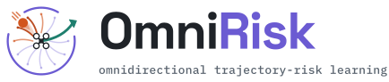

### Omnidirectional Trajectory-Risk Learning for Agile Quadrotor Dynamic Avoidance

Yifan He<sup>†1</sup> · <a href="https://ly041021.github.io/">Yang Liu</a><sup>†1,2</sup> · Wenhao Zhao<sup>†1</sup> · Hai Lin<sup>1</sup> · Deping Zhang<sup>1</sup> · Mingze Ma<sup>1</sup> · <a href="https://zhouxin.me/">Xin Zhou</a><sup>1</sup><br>
<a href="https://scholar.google.com/citations?user=4RObDv0AAAAJ">Fei Gao</a><sup>1,2</sup> · Huan Yu<sup>\*1,2</sup> · <a href="http://zipengdai.com/">Zipeng Dai</a><sup>\*1</sup> · Ziming Ding<sup>\*1</sup><br>
<sup>1</sup>Differential Robotics · <sup>2</sup>Zhejiang University&nbsp;&nbsp;&nbsp;<sup>†</sup>equal contribution · <sup>\*</sup>corresponding

<a href="https://www.youtube.com/watch?v=Y3w2-He-zMM&amp;t=32s"></a>
<a href="https://arxiv.org/abs/2609.18191"></a>

<a href="#citation"></a>

[](https://arxiv.org/abs/2609.18191)

[](LICENSE)


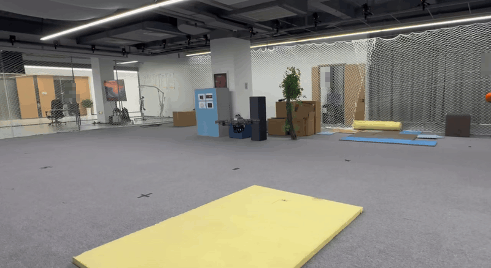

OmniRisk moves trajectory-risk evaluation **offline**. Onboard, one forward pass scores every candidate<br>
maneuver around the drone, so planning cost **does not grow with the number of obstacles**.

<br>

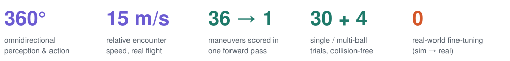

</div>

## Demos

### Repeated trials

<table>
  <tr>
    <td width="50%" align="center">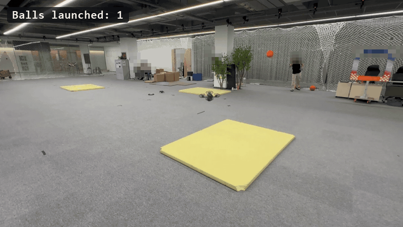<br><b>Single-ball tests</b><br><sub>30 trials, all collision-free</sub></td>
    <td width="50%" align="center">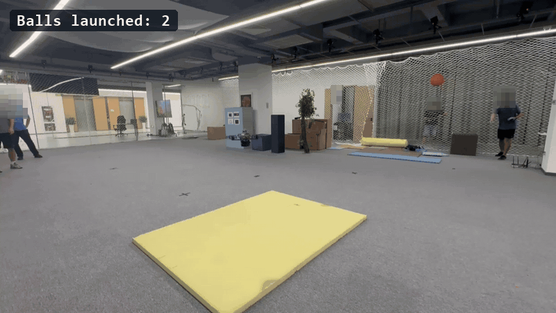<br><b>Multi-ball tests</b><br><sub>4 trials, 12 balls in total, all collision-free</sub></td>
  </tr>
</table>

### Open vs. constrained space

<table>
  <tr>
    <td width="50%" align="center">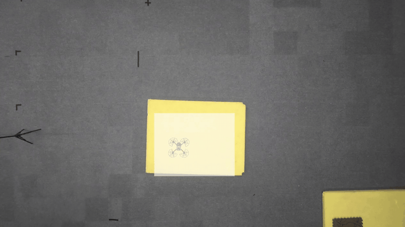<br><b>Open space</b><br><sub>top view · ×0.2 · nothing nearby, free to dodge in any direction</sub></td>
    <td width="50%" align="center">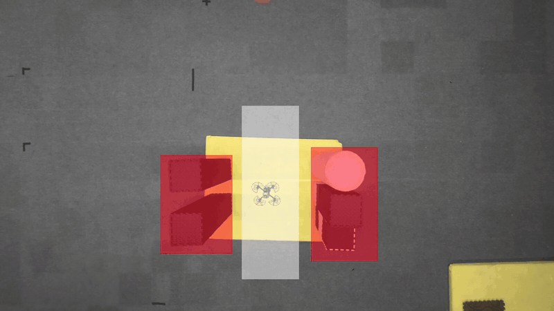<br><b>Constrained space</b><br><sub>top view · ×0.2 · obstacles on both sides, escape stays in the free corridor</sub></td>
  </tr>
</table>

### Dynamic + static obstacles

<p align="center">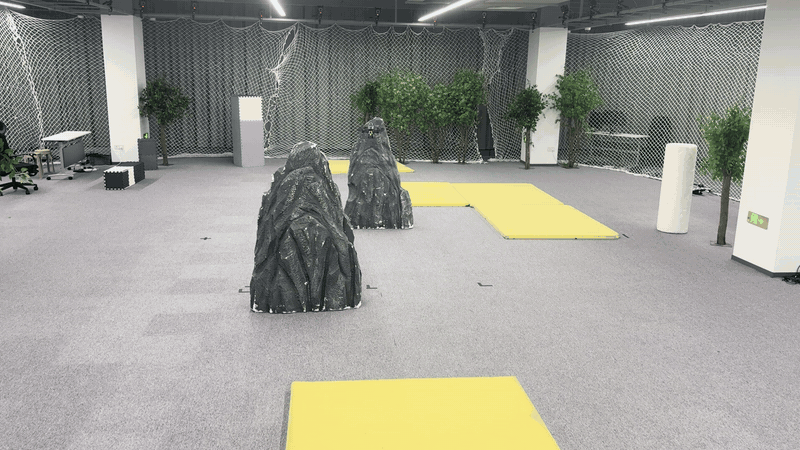<br><b>Crossing ball among rocks</b><br><sub>dodges a ball thrown across its path while clearing rock-shaped obstacles</sub></p>

### Different thrown objects

<table>
  <tr>
    <td width="50%" align="center">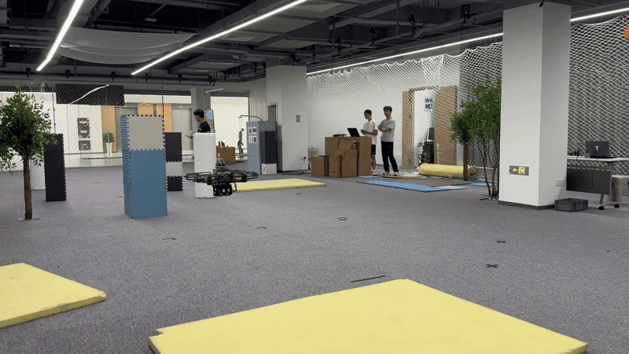<br><b>Thrown ball</b><br><sub>motion trails show the ball's arc and the escape path</sub></td>
    <td width="50%" align="center">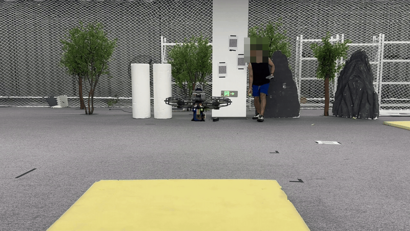<br><b>Tennis ball</b><br><sub>small and fast, only a few LiDAR returns</sub></td>
  </tr>
  <tr>
    <td width="50%" align="center">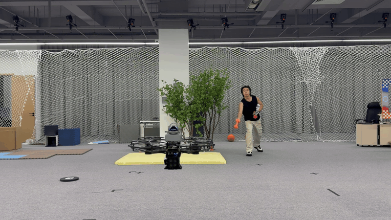<br><b>Dumbbell</b><br><sub>irregular rigid body, tumbling in flight</sub></td>
    <td width="50%" align="center">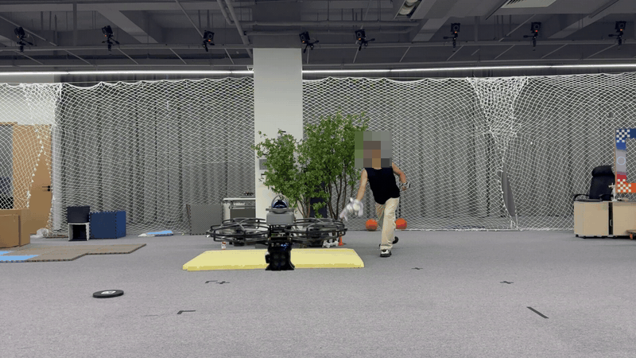<br><b>Plush toy</b><br><sub>soft, deforms mid-air</sub></td>
  </tr>
</table>

## Results

<div align="center">

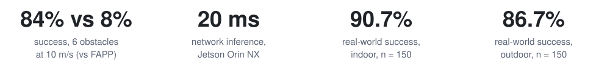

<table align="center">
  <tr>
    <td width="50%" align="center">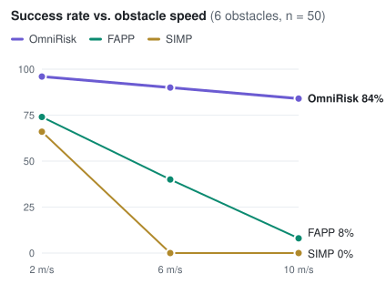</td>
    <td width="50%" align="center">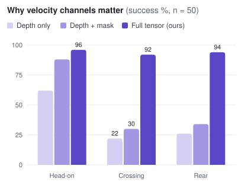</td>
  </tr>
</table>

<table align="center">
  <tr>
<td width="50%" align="center" valign="top">

**Planning latency on Jetson Orin NX** (6 obstacles)

| Method | P95 (ms) | Deadline miss |
|:--|--:|--:|
| SIMP | 2110.9 | 96.3% |
| FAPP | 17.6 | 0.0% |
| **OmniRisk** | **45.6** | **3.0%** |

</td>
<td width="50%" align="center" valign="top">

**Zero-shot real-world success** (n = 50 per cell)

| Object | Indoor | Outdoor |
|:--|--:|--:|
| Tennis ball | 94.0% | 90.0% |
| Foam basketball | 86.0% | 82.0% |
| Plush toy | 92.0% | 88.0% |
| **All types** | **90.7%** | **86.7%** |

</td>
  </tr>
</table>

</div>

> [!NOTE]
> FAPP plans faster (~17 ms) but refines a single trajectory; with 6 obstacles at 10 m/s its success drops to 8% vs. 84% for OmniRisk.

## Hardware

<table align="center">
  <tr>
<td width="400" align="center">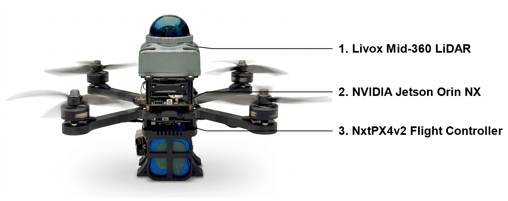</td>
<td align="center" valign="middle">

| Component | Model |
|:--|:--|
| LiDAR | Livox Mid-360 |
| Onboard computer | NVIDIA Jetson Orin NX |
| Flight controller | NxtPX4v2 |
| Odometry | FAST-LIO2 |
| Moving-object detection | M-detector |

</td>
  </tr>
</table>

## Roadmap

- [x] Training code, simulator & dataset generator
- [x] ROS planner & real-world deployment guide
- [x] Pretrained models
- [ ] Simulation demos
- [ ] Project page

## Quick start

Tested on Ubuntu 20.04 + ROS Noetic + CUDA (x86) and Jetson Orin NX (JetPack 5.1.x).

<details>
<summary><b>Repository structure</b></summary>
<br>

```
OmniRisk/     learning-based planner: network, training and the ROS planning node
Simulator/    CUDA LiDAR / depth simulator and dataset generator
Controller/   SO(3) quadrotor dynamics and controller for simulation
ros_ws/       onboard stack: FAST-LIO, M-detector, px4ctrl, EKF, Livox driver
docker/       simulation (x86) and deployment (Jetson) images
scripts/      one-shot install and build
```

</details>

<details>
<summary><b>Installation</b></summary>
<br>

```bash
bash scripts/build.sh               # install dependencies + build
bash scripts/build.sh --build-only  # rebuild only
bash scripts/build.sh --no-sim      # skip Controller / Simulator
```

</details>

<details>
<summary><b>Pretrained model</b></summary>
<br>

```bash
mkdir -p OmniRisk/saved/run_1
wget -O OmniRisk/saved/run_1/epoch60.pth \
  https://github.com/VANdexj/OmniRisk/releases/download/v1.0/omnirisk_epoch60.pth
```

Then run with `--trial 1 --epoch 60` (`trt_transfer.py` uses this checkpoint by default).

</details>

<details>
<summary><b>Simulation</b></summary>
<br>

```bash
# T1 Dynamics
source Controller/devel/setup.bash
roslaunch so3_quadrotor_simulator simulator_attitude_control.launch

# T2 Environment + LiDAR
source Simulator/devel/setup.bash
rosrun sensor_simulator sensor_simulator_cuda

# T3 M-detector
source ros_ws/devel/setup.bash
roslaunch m_detector detector_mid360.launch points_topic:=/lidar_points points_in_world_frame:=false odom_topic:=/sim/odom

# T4 OmniRisk (add --flight_mode nav, then set the goal with RViz 2D Nav Goal)
source ros_ws/devel/setup.bash && source omnirisk_env/bin/activate
cd OmniRisk && python omnirisk_node.py --trial <n> --epoch <k> --odom_topic /sim/odom --lidar_topic /lidar_points

# T5 RViz
source ros_ws/devel/setup.bash
rviz -d OmniRisk/omnirisk.rviz

# T6 Joystick goal
source ros_ws/devel/setup.bash
cd OmniRisk && python3 rc_goal_teleop.py _odom_topic:=/sim/odom
```

</details>

<details>
<summary><b>Training</b></summary>
<br>

```bash
cd Simulator && source devel/setup.bash
rosrun sensor_simulator dataset_generator   # → dataset/

cd ../OmniRisk && source ../omnirisk_env/bin/activate
python train.py                             # → saved/run_<n>/epoch<k>.pth
tensorboard --logdir saved
```

</details>

<details>
<summary><b>TensorRT acceleration</b></summary>
<br>

```bash
cd OmniRisk
python trt_transfer.py --trial <n> --epoch <k>   # run on the deployment device
python omnirisk_node.py --use_tensorrt 1
```

</details>

<details>
<summary><b>Real-world deployment</b></summary>
<br>

```bash
# In every terminal
source ros_ws/devel/setup.bash

# T1 MAVROS
sudo chmod 666 /dev/ttyACM0
roslaunch mavros px4.launch fcu_url:=/dev/ttyACM0:57600

# After MAVROS connects: IMU / attitude at 200Hz
rosrun mavros mavcmd long 511 105 5000 0 0 0 0 0  # HIGHRES_IMU
rosrun mavros mavcmd long 511 31  5000 0 0 0 0 0  # ATTITUDE_QUATERNION
rosrun mavros mavcmd long 511 83  5000 0 0 0 0 0  # ATTITUDE_TARGET

# T2 MID360 + FAST-LIO + EKF
roslaunch fast_lio fastlio_ekf.launch

# T3 px4ctrl
roslaunch px4ctrl run_ctrl.launch

# T4 M-detector
roslaunch m_detector detector_mid360.launch

# T5 OmniRisk
source omnirisk_env/bin/activate
cd OmniRisk && python omnirisk_node.py --use_tensorrt 1

# T6 RViz
rviz -d OmniRisk/omnirisk.rviz

# T7 Joystick goal (_input_mode:=usb | mavros)
cd OmniRisk && python3 rc_goal_teleop.py _input_mode:=usb

# Takeoff / land
rostopic pub -1 /px4ctrl/takeoff_land quadrotor_msgs/TakeoffLand "takeoff_land_cmd: 1"
rostopic pub -1 /px4ctrl/takeoff_land quadrotor_msgs/TakeoffLand "takeoff_land_cmd: 2"

# Checks
rostopic hz /ekf_quat/ekf_odom              # > 50Hz
rostopic hz /mavros/setpoint_raw/attitude   # > 100Hz
rostopic hz /so3_control/pos_cmd
```

</details>

## Citation

```bibtex
@article{he2026omnirisk,
  title   = {OmniRisk: Omnidirectional Trajectory-Risk Learning for Agile Quadrotor Dynamic Avoidance},
  author  = {He, Yifan and Liu, Yang and Zhao, Wenhao and Lin, Hai and Zhang, Deping and Ma, Mingze and Zhou, Xin and Gao, Fei and Yu, Huan and Dai, Zipeng and Ding, Ziming},
  journal = {arXiv preprint arXiv:2609.18191},
  year    = {2026}
}
```

## Acknowledgements

This work was carried out at Differential Robotics; we are especially grateful to [Zipeng Dai](https://scholar.google.com/citations?user=e2c7Kt0AAAAJ) for his invaluable mentorship.

## License

Released under the [MIT License](LICENSE).
