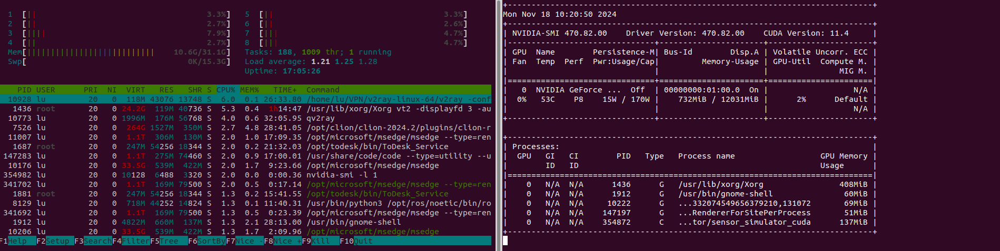
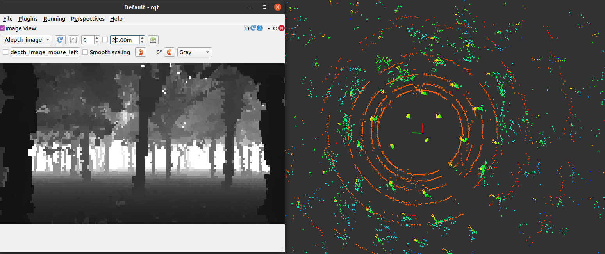
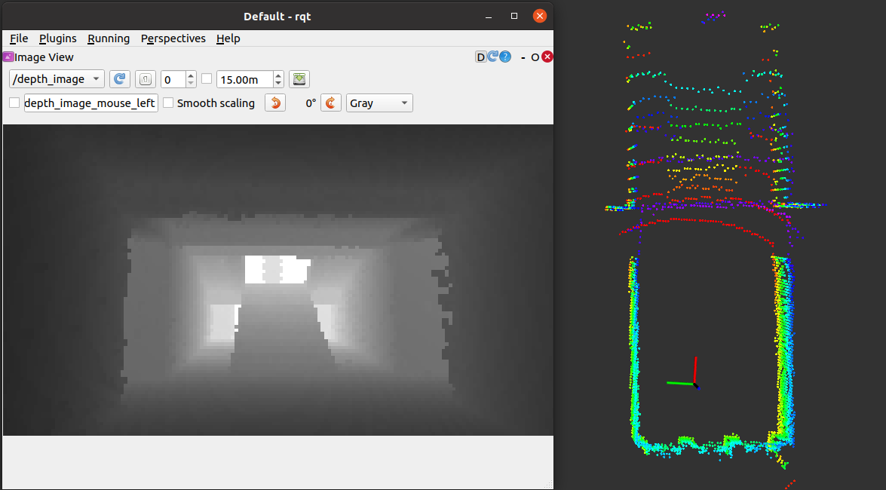
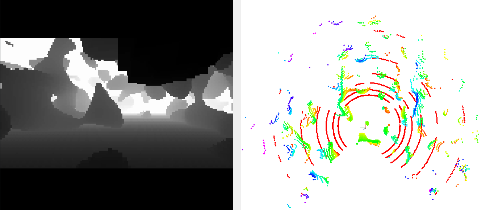
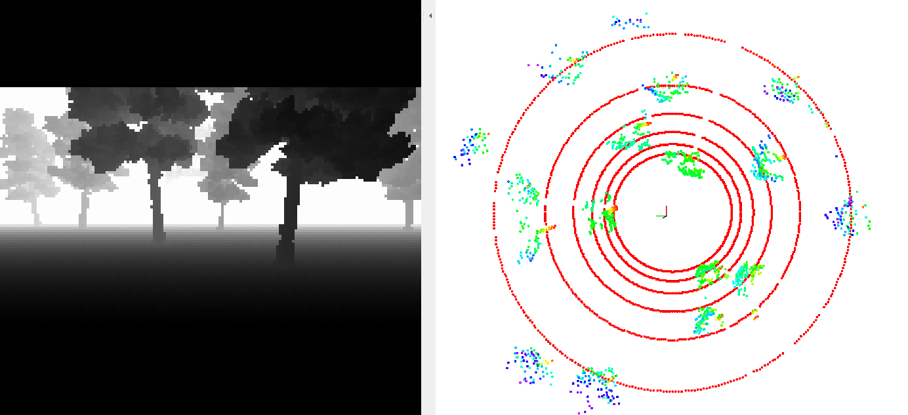
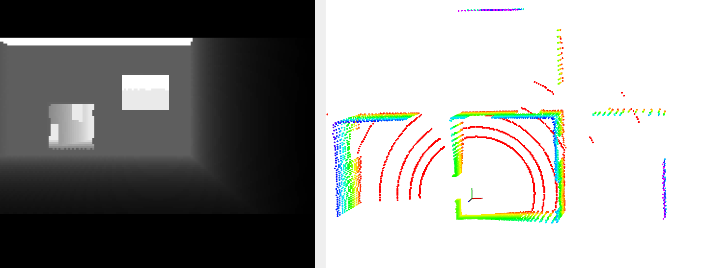
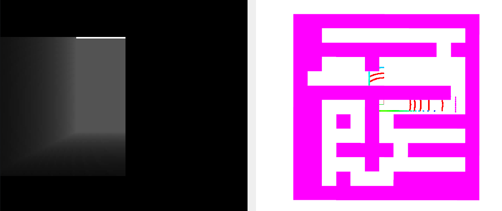

# Real-world point cloud / depth image simulation (CUDA supported)

### 1 Dependencies

CUDA; ROS; OpenCV; PCL; (mostly satisfied if ROS is installed) yaml-cpp
```angular2html
sudo apt-get install libyaml-cpp-dev
```

### 2 Build
```angular2html
catkin build
```
Note: the CMakeLists uses `cuda_select_nvcc_arch_flags` for auto-detection. If the build fails, set the CUDA architecture manually by replacing, from line 25 of the CMakeLists:
```
cuda_select_nvcc_arch_flags(ARCH_FLAGS)
...
endif()
```
with (120 for an RTX 5060; set it for your own device):
```
set(ARCH_FLAGS "-gencode arch=compute_120,code=sm_120")
```

### 3 Run
```angular2html
source devel/setup.bash
# GPU version (recommended, RTX 3060 depth output > 1000fps)
rosrun sensor_simulator sensor_simulator_cuda

# CPU version (heavy on resources, only for testing when the GPU build cannot be fixed)
rosrun sensor_simulator sensor_simulator
```

See [config](config/config.yaml) for sensor parameters and the point cloud environment. Key parameters:
```
# topics
odom_topic: "/sim/odom"
depth_topic: "/depth_image"
lidar_topic: "/lidar_points"
# use a prebuilt point cloud map or a random map
random_map: true
# random map type
maze_type: 5   # 1: cave 2: pillars 3: maze 5: forest 6: rooms
```

### 4 Simulated pose publishing and simple visualization (optional)
```angular2html
cd src/sensor_simulator
python sim_odom.py

cd src/sensor_simulator
rviz -d rviz.rviz
```


### 5 Real-time performance and resource usage

CPU version (i7-9700):
depth image 0.02s, point cloud 0.01s

GPU version (RTX 3060):
depth image 0.001s, point cloud 0.001s

GPU version resource usage (at 30HZ):


### 6 Example scenes

<table>
  <tr>
    <td align="center">
      
      <p>1. realworld forest</p>
    </td>
    <td align="center">
      
      <p>2. realworld building</p>
    </td>
  </tr>
  <tr>
    <td align="center">
      
      <p>3. 3D perlin</p>
    </td>
    <td align="center">
      
      <p>4. random forest</p>
    </td>
  </tr>
  <tr>
    <td align="center">
      
      <p>5. random room</p>
    </td>
    <td align="center">
      
      <p>6. random maze</p>
    </td>
  </tr>
</table>

**Notes:**

1. The GPU version map has no boundary and extends infinitely; the CPU version map is bounded (can be copied several times, deprecated)

### acknowledgment

Some maps (3D Perlin, random maze) are generated based on: https://github.com/HKUST-Aerial-Robotics/mockamap, thanks for their excellent work!